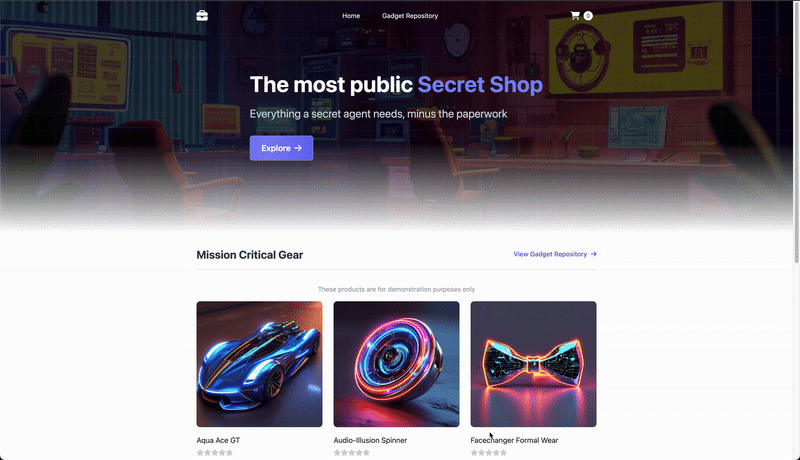

# Hassan's Retail Store Sample Application - Amazon EKS with ArgoCD
 
<div align="center">
  <div align="center">

  </div>

  <strong>
  <h2>Hassan's AWS Containerized Retail Platform</h2>
  </strong>
</div>

This retail store application showcases enterprise-grade containerization patterns on AWS. The platform demonstrates a comprehensive e-commerce solution featuring product management, cart functionality, and order processing, implemented using contemporary DevOps methodologies including ArgoCD for continuous deployment and Infrastructure as Code paradigms.


## Table of Contents

- [Platform Overview](#platform-overview)
- [System Architecture](#system-architecture)
- [Requirements](#requirements)
- [Rapid Deployment](#rapid-deployment)
- [Implementation Guide](#implementation-guide)
- [ArgoCD Setup](#argocd-setup)
- [EKS Auto Mode Features](#eks-auto-mode-features)
- [Infrastructure Stack](#infrastructure-stack)
- [Continuous Integration & Deployment](#continuous-integration--deployment)
- [Observability & Monitoring](#observability--monitoring)
- [Resource Cleanup](#resource-cleanup)
- [Issue Resolution](#issue-resolution)

## Platform Overview

Hassan's Retail Store Application exemplifies a cloud-native microservices ecosystem deployed on AWS EKS. The platform integrates five core microservices delivering a comprehensive e-commerce experience:




**Core Microservices:**

- **UI Service (Java/Spring Boot)**: Frontend web interface providing the customer-facing retail store experience
- **Catalog Service (Go + MySQL)**: Product catalog management system handling product information and inventory data
- **Cart Service (Java + DynamoDB)**: Shopping cart management system storing and managing customer cart items
- **Checkout Service (Node.js + Redis)**: Payment processing orchestrator managing temporary customer data during purchase flow
- **Orders Service (Java + MySQL)**: Order fulfillment system processing and persisting completed orders

## System Architecture

The platform architecture intentionally employs sophisticated design patterns to showcase distributed system concepts. Each microservice maintains independence with specific infrastructure requirements and supports various backend configurations (for instance: Cart service accommodates both MongoDB and DynamoDB).

| Microservice Component     | Technology Stack | Container Registry                                                          | Configuration Chart                                                              | Functionality                                      |
| -------------------------- | ---------------- | --------------------------------------------------------------------------- | --------------------------------------------------------------------------------- | -------------------------------------------------- |
| [UI](./src/ui/)            | Java/Spring Boot | [Registry](https://gallery.ecr.aws/aws-containers/retail-store-sample-ui)       | [Configuration](src/ui/chart/values.yaml)    | Frontend web interface for retail store            |
| [Catalog](./src/catalog/)  | Go + MySQL       | [Registry](https://gallery.ecr.aws/aws-containers/retail-store-sample-catalog)  | [Configuration](src/catalog/chart/values.yaml)  | Product catalog and inventory management           |
| [Cart](./src/cart/)        | Java + DynamoDB  | [Registry](https://gallery.ecr.aws/aws-containers/retail-store-sample-cart)     | [Configuration](src/cart/chart/values.yaml)     | Shopping cart state management                     |
| [Checkout](./src/checkout) | Node.js + Redis  | [Registry](https://gallery.ecr.aws/aws-containers/retail-store-sample-checkout) | [Configuration](src/checkout/chart/values.yaml) | Purchase flow orchestration and temporary storage  |
| [Orders](./src/orders)     | Java + MySQL     | [Registry](https://gallery.ecr.aws/aws-containers/retail-store-sample-orders)   | [Configuration](src/orders/chart/values.yaml)   | Order processing and persistent storage            |

## Technical Infrastructure

Hassan's implementation embraces cloud-native architectural patterns:

- **Distributed Microservices**: Autonomous service development and deployment
- **Container Orchestration**: Complete containerization on Kubernetes platform
- **ArgoCD Management**: Git-driven application lifecycle management
- **Infrastructure as Code**: Terraform-defined AWS resource provisioning
- **Automated CI/CD**: GitHub Actions-powered build and release automation

## Rapid Deployment

**Ready for immediate deployment?** Execute these commands for quick setup:

1. **Setup Tools**: Install AWS CLI, Terraform, kubectl, Docker, Helm
2. **AWS Configuration**: Execute `aws configure` with valid credentials
3. **Repository Clone**: `git clone hhttps://github.com/Hassan23121999/retail-store-app.git`
4. **Infrastructure Provisioning**: Execute Terraform deployment phases
5. **Platform Access**: Retrieve load balancer endpoint and explore Hassan's retail store

## Requirements

### **Essential Toolchain**

| Component     | Version | Documentation                                                                        |
| ------------- | ------- | ------------------------------------------------------------------------------------ |
| **AWS CLI**   | v2+     | [Setup Documentation](https://docs.aws.amazon.com/cli/latest/userguide/install-cliv2.html) |
| **Terraform** | 1.0+    | [Setup Documentation](https://developer.hashicorp.com/terraform/install)                   |
| **kubectl**   | 1.33+   | [Setup Documentation](https://kubernetes.io/docs/tasks/tools/)                             |
| **Docker**    | 20.0+   | [Setup Documentation](https://docs.docker.com/get-docker/)                                 |
| **Helm**      | 3.0+    | [Setup Documentation](https://helm.sh/docs/intro/install/)                                 |
| **Git**       | 2.0+    | [Setup Documentation](https://git-scm.com/downloads) 

### **Automated Installation Process**

<details>
<summary><strong>🔧 Single-Command Setup</strong></summary>

```bash
#!/bin/bash
# Hassan's prerequisite installer

# AWS CLI installation
curl "https://awscli.amazonaws.com/awscli-exe-linux-x86_64.zip" -o "awscliv2.zip"
unzip awscliv2.zip
sudo ./aws/install

# Terraform setup
curl -fsSL https://apt.releases.hashicorp.com/gpg | sudo apt-key add -
sudo apt-add-repository "deb [arch=amd64] https://apt.releases.hashicorp.com $(lsb_release -cs) main"
sudo apt-get update && sudo apt-get install terraform

# kubectl installation
curl -LO "https://dl.k8s.io/release/v1.33.3/bin/linux/amd64/kubectl"
chmod +x kubectl
sudo mv kubectl /usr/local/bin/

# Docker setup
curl -fsSL https://get.docker.com -o get-docker.sh
sudo sh get-docker.sh

# Helm installation
curl https://raw.githubusercontent.com/helm/helm/main/scripts/get-helm-3 | bash

# Installation verification
aws --version
terraform --version
kubectl version --client
docker --version
helm version
```

</details>

## Implementation Guide

Execute these commands to deploy Hassan's retail store:

### Step 1. Setup AWS with **`Root User`** Access:

Configure your AWS CLI with **Root user permissions:**

```sh
aws configure
```

### Step 2. Retrieve Repository:

```sh
git clone https://github.com/Hassan23121999/retail-store-app.git
```

### Step 3. Provision Infrastructure via Terraform:

Hassan's deployment executes in two strategic phases:

#### Phase 1: EKS Cluster Creation

Terraform initializes and provisions the retail_app_eks module resources.

```sh
cd retail-store-sample-app/terraform/
terraform init
terraform apply -target=module.retail_app_eks -target=module.vpc --auto-approve
```

This establishes foundational infrastructure:
- VPC configuration with public/private subnets
- Amazon EKS cluster with Auto Mode activated
- Security groups and IAM configurations

### Step 4. Configure kubectl for EKS Access:

```
aws eks update-kubeconfig --name retail-store --region <region>
```

#### Phase 2: Complete Infrastructure Deployment

```bash
terraform apply --auto-approve
```

This provisions:
- ArgoCD for continuous deployment
- NGINX Ingress Controller
- Cert Manager for TLS management

### Step 5. Access Hassan's Application:

Retrieve your ingress EXTERNAL-IP and access it via browser to explore the retail store.

```sh
kubectl get svc -n ingress-nginx
```

Use the EXTERNAL-IP of the ingress-nginx-controller service to access the application.

## ArgoCD Setup

### Step 6. Verify ArgoCD Installation:

Confirm ArgoCD deployment:

```
kubectl get pods -n argocd
```

### Step 7. Access ArgoCD Interface:

**Retrieve ArgoCD credentials:**
```
kubectl -n argocd get secret argocd-initial-admin-secret -o jsonpath='{.data.password}' | base64 -d
```

**Establish ArgoCD port-forward:**
```
kubectl port-forward svc/argocd-server -n argocd 8080:443 &
```

Access via browser: https://localhost:8080

Credentials:
- Username: admin 
- Password: (retrieved from previous command)

### ArgoCD Dashboard Features

ArgoCD Dashboard provides:
- **Deployment Status**: Live synchronization status for all microservices
- **Resource Management**: Comprehensive Kubernetes resource visualization
- **Sync Controls**: Manual synchronization and rollback functionality
- **Health Tracking**: Service and resource health indicators

## Continuous Integration & Deployment

### GitHub Actions Configuration

Configure GitHub secrets for automated pipeline execution:

**Create IAM User, attach policies, and generate access keys**

Navigate to GitHub repository → Settings → Secrets and variables → Actions → New repository secret.

| Secret Identifier      | Configuration Value                |
|-----------------------|------------------------------------|
| `AWS_ACCESS_KEY_ID`   | `Your AWS Access Key`              |
| `AWS_SECRET_ACCESS_KEY` | `Your AWS Secret Key`            |
| `AWS_REGION`          | `deployment-region`                 |
| `AWS_ACCOUNT_ID`      | `your-aws-account-id`              |

Following configuration, repository changes automatically initiate GitHub Actions workflows.

GitHub Actions automatically builds and publishes updated containers to Amazon ECR.

## Observability & Monitoring

### Deployment Verification

Confirm node status:

```bash
kubectl get nodes
```

### Application Status Tracking

```bash
kubectl get pods -n retail-store
kubectl get ingress -n retail-store
```

## Resource Cleanup

Remove all Terraform-provisioned resources:

### Phase 1 Cleanup:

```bash
terraform destroy -target=module.retail_app_eks --auto-approve
```

### Phase 2 Cleanup:

```
terraform destroy --auto-approve
```

> [!NOTE]
> ECR Repositories require manual deletion through AWS Console.

## Issue Resolution

### Common Challenges

#### **Container Pull Failures**
```
Error: Failed to pull image "123456789012.dkr.ecr.us-west-2.amazonaws.com/retail-store-ui:abc1234"
```
**Resolution Steps**:
1. Verify AWS credentials and ECR access permissions
2. Confirm GitHub Actions completion for image builds
3. Check ECR repository exists and contains images
4. Validate IAM roles have appropriate permissions

#### **GitHub Actions Trigger Issues**
**Resolution Steps**:
1. Confirm modifications in `src/` directory
2. Verify GitHub Actions activation in repository settings
3. Check configured secrets are correct
4. Review workflow logs for specific errors

#### **ArgoCD Sync Problems**
**Resolution Steps**:
1. Verify ArgoCD has access to Git repository
2. Check application manifests are valid
3. Ensure cluster has sufficient resources
4. Review ArgoCD application logs for errors

### Support Resources

- **Deployment challenges**: Reference this documentation
- **Infrastructure concerns**: Analyze Terraform outputs
- **Application problems**: Inspect ArgoCD dashboard and kubectl logs
- **Container issues**: Check ECR and pod logs

## Licensing

This project operates under Apache License 2.0 - review [LICENSE](./LICENSE) for complete terms.

## Community Support

- **Issue Tracking**: [GitHub Issues](https://github.com/Hassan23121999/retail-store-app/issues)

---

<div align="center">

**⭐ Star Hassan's repository if you found it valuable!**

**📧 For questions and support, open an issue on GitHub**

</div>